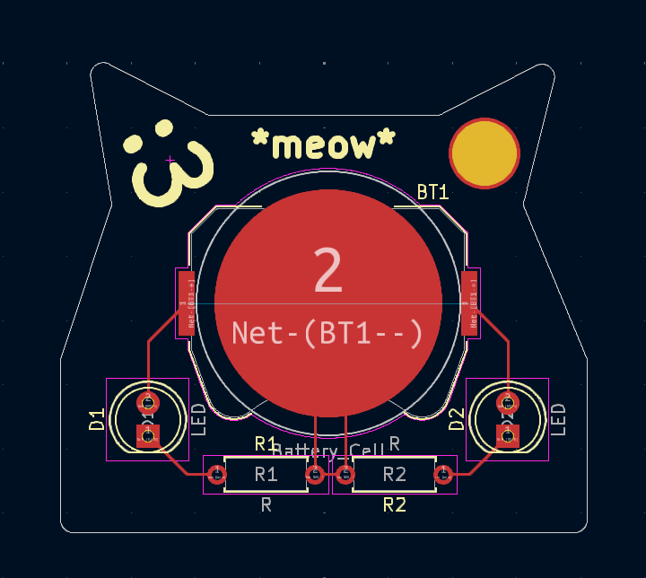
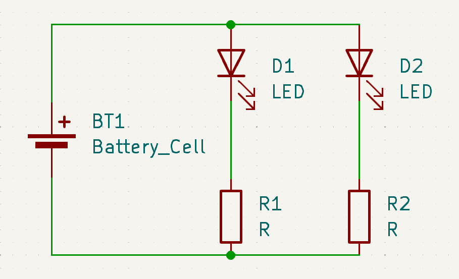
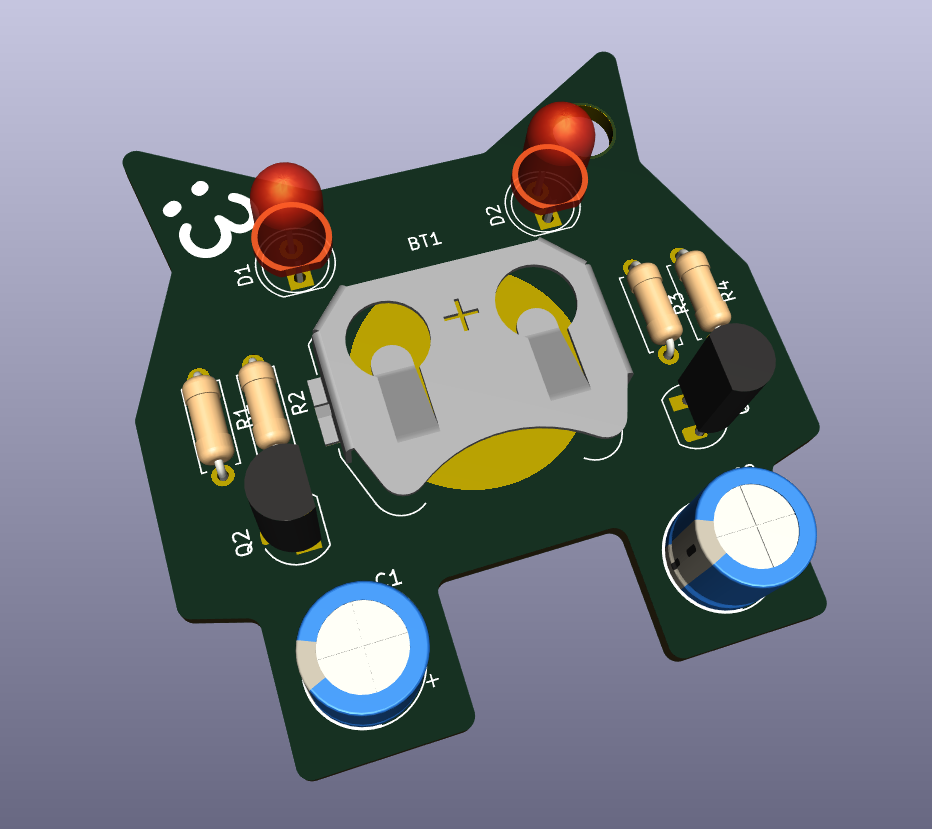

# solder
a battery powered cat keychain with LEDs by @randomhumandownhere

## bill of materials:
| Component     | Quantity |
| ------------- | -------- |
| Battery       | 1x       |
| LED           | 2x       |
| 220Ω Resistor | 2x       |

## pictures!

