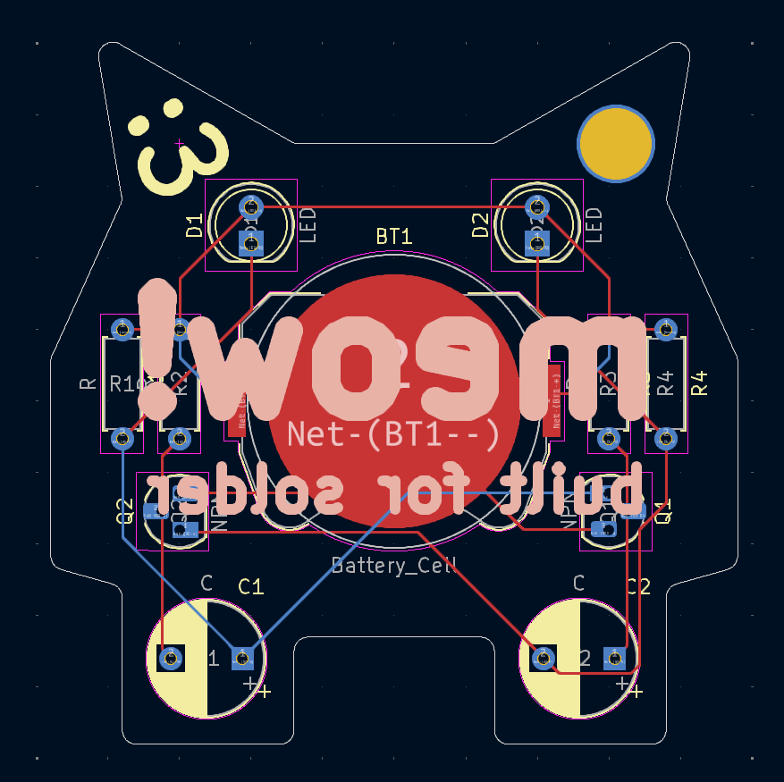
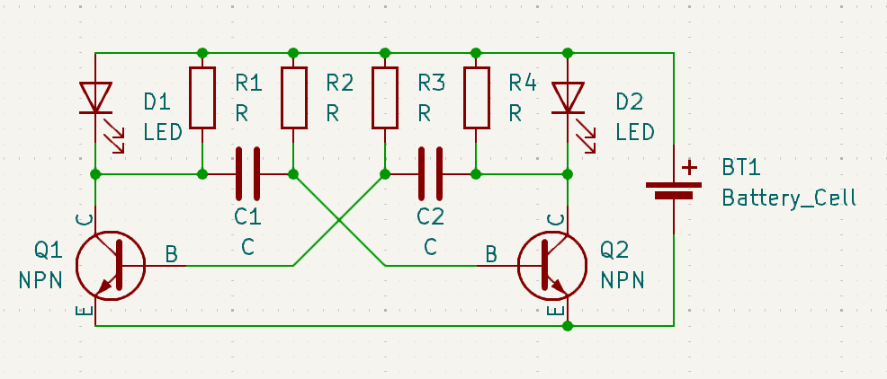

# solder
a battery powered cat keychain with blinking LEDs by @randomhumandownhere

## bill of materials:
| Component           | Quantity |
| ------------------- | -------- |
| CR2032 Battery Cell | 1x       |
| 5mm LED             | 2x       |
| 220Ω Resistor       | 2x       |
| 4.7kΩ Resistor      | 2x       |
| 10µF Capacitor      | 2x       |
| 2N3904 Transistor   | 2x       |

## pictures!

the pcb :3

some schematics

my simulation in the falstad circuit simulation applet

final pcb render!